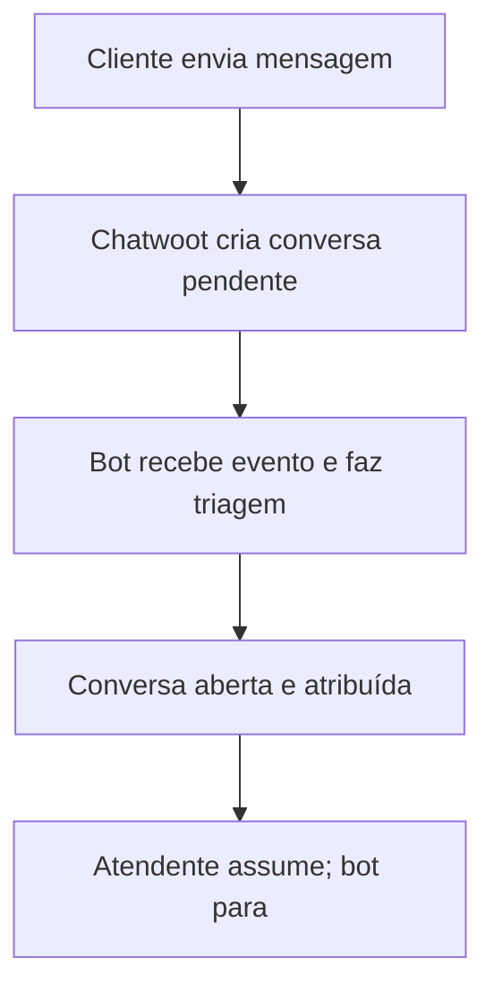
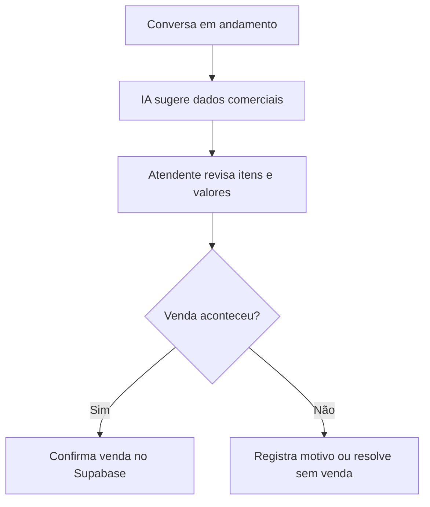
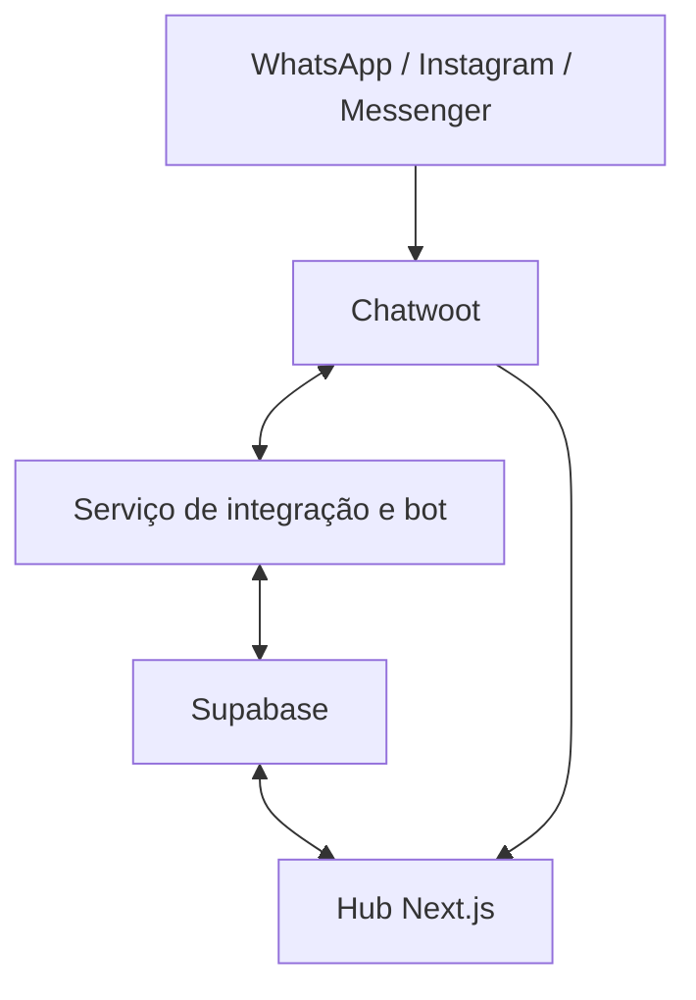

# PRD — MVP Hub Omnichannel para Farmácia

**Status:** Rascunho estruturado para validação com o cliente  
**Versão:** 0.1  
**Data:** 03/09/2026  
**Responsável pelo produto:** Vale Mind  

---

## 1. Resumo executivo

O produto será um hub de atendimento e vendas para farmácias. Ele reunirá mensagens de WhatsApp, Instagram e Facebook Messenger, permitirá que atendentes trabalhem em equipe e registrará dados comerciais estruturados para alimentar um dashboard gerencial.

O MVP utilizará o Chatwoot como central operacional de conversas, a Evolution API como conexão inicial do WhatsApp, o Supabase para dados próprios do produto e a infraestrutura existente em Hostinger/Coolify.

O chatbot fará a recepção e a triagem inicial. Quando um funcionário assumir, o bot deixará de responder, mas um processo de extração poderá continuar trabalhando silenciosamente para sugerir dados da venda. Nenhuma venda será contabilizada sem confirmação humana.

O ERP atual da farmácia ainda não foi identificado. Portanto, a integração com estoque, preços e caixa ficará preparada arquiteturalmente, mas fora do primeiro MVP.

---

## 2. Problema

Hoje a farmácia possui um bot que envia somente uma mensagem automática de recepção:

> 👋 Olá! Que bom ter você por aqui.  
> Já estamos direcionando sua conversa para a nossa equipe!  
> Enquanto isso, pode nos adiantar o produto desejado ou enviar a receita médica?  
> Assim que assumirmos, já te passamos os valores e disponibilidade! 🛵💨

As principais limitações percebidas são:

- canais de atendimento separados;
- bot sem conversação ou triagem estruturada;
- dificuldade para acompanhar quem respondeu e quem transferiu cada conversa;
- ausência de um fluxo confiável para transformar conversas em dados de vendas;
- necessidade de comunicação entre funcionários e unidades;
- dashboard atual limitado ou pouco confiável;
- custo considerado alto da API oficial do WhatsApp no cenário atual do cliente.

---

## 3. Objetivo do MVP

Entregar uma demonstração funcional que permita ao cliente experimentar o fluxo principal:

1. receber uma mensagem por WhatsApp, Instagram ou Messenger;
2. receber a saudação e a triagem inicial do bot;
3. encaminhar a conversa para um atendente;
4. responder com texto, imagem, documento e áudio;
5. transferir o atendimento entre funcionários ou equipes;
6. registrar e confirmar uma venda;
7. visualizar os dados no dashboard;
8. consultar histórico e auditoria operacional;
9. conversar em salas internas da equipe.

### Resultado esperado

Ao final da demonstração, o cliente deve conseguir avaliar se o produto representa corretamente a rotina da farmácia antes de investimentos em integração com ERP, migração definitiva de canais e automações avançadas.

---

## 4. Princípios do produto

1. **O Chatwoot não será reconstruído.** Ele será usado como mecanismo especializado de atendimento.
2. **O dashboard comercial usará dados estruturados.** A IA poderá sugerir dados, mas não será a fonte final da venda.
3. **Humano no controle.** O atendente confirma preço, disponibilidade, substituições, receita e conclusão da venda.
4. **Segurança desde o início.** Dados serão isolados por organização e unidade, com privilégios mínimos.
5. **Integrações desacopladas.** WhatsApp, Chatwoot, Meta, ERP e modelo de IA terão adaptadores próprios.
6. **MVP evolutivo.** A primeira versão deverá permitir adicionar ERP, e-commerce e API oficial do WhatsApp sem reescrever o núcleo.
7. **Minimização de dados.** O hub não copiará integralmente conversas e receitas sem necessidade.

---

## 5. Decisões já tomadas

| Decisão | Definição para o MVP |
|---|---|
| Central de atendimento | Chatwoot self-hosted |
| WhatsApp | Evolution API, com número separado para homologação |
| Instagram | Canal oficial da Meta integrado ao Chatwoot |
| Facebook | Facebook Messenger integrado ao Chatwoot |
| Banco do hub | Supabase/PostgreSQL |
| Autenticação do hub | Supabase Auth |
| Infraestrutura | VPS Hostinger gerenciada pelo Coolify |
| Interface do hub | Next.js, TypeScript, Tailwind CSS e shadcn/ui |
| Atendentes iniciais | Aproximadamente três |
| ERP | Integração posterior; fornecedor ainda desconhecido |
| Venda | Exige confirmação humana |
| Receita por imagem | Apenas recebimento e encaminhamento humano no MVP |

---

## 6. Usuários e permissões

### 6.1 Administrador

- cadastra unidades e usuários;
- define permissões e equipes;
- acessa configurações de integrações;
- visualiza dashboard completo e auditoria;
- gerencia catálogo provisório;
- configura salas internas.

### 6.2 Gestor

- visualiza todas as conversas autorizadas;
- acompanha vendas, atendimento e desempenho;
- consulta auditoria operacional;
- corrige ou cancela registros de venda com justificativa;
- acessa salas gerais e das unidades sob sua responsabilidade.

### 6.3 Atendente

- recebe e assume conversas;
- responde por texto e áudio;
- adiciona notas privadas;
- transfere conversas;
- consulta contexto do cliente;
- confirma, corrige ou rejeita a sugestão de venda;
- acessa apenas unidades e salas autorizadas.

### 6.4 Auditor ou visualizador futuro

- acesso somente leitura a relatórios e eventos autorizados;
- não responde clientes nem altera vendas.

> Permissões do hub serão mantidas em dados controlados pela aplicação ou em `app_metadata`. Dados editáveis pelo usuário não poderão autorizar acesso.

---

## 7. Escopo funcional do MVP

### RF-001 — Caixa de entrada omnichannel

**Prioridade:** Obrigatória

- receber conversas do WhatsApp via Evolution API;
- receber mensagens do Instagram;
- receber mensagens do Facebook Messenger;
- identificar visualmente o canal de origem;
- manter histórico por contato dentro do Chatwoot;
- permitir filtros por canal, status, equipe, atendente e unidade.

**Critério de aceite:** uma mensagem enviada em cada canal de homologação aparece na caixa correta e pode ser respondida pelo atendente.

### RF-002 — Bot de recepção e triagem

**Prioridade:** Obrigatória

O bot deverá:

- enviar uma saudação configurável;
- reconhecer ao menos as intenções `comprar produto`, `enviar receita`, `consultar pedido`, `tirar dúvida` e `falar com atendente`;
- coletar nome, cidade ou unidade desejada quando necessário;
- registrar o nome livre do produto informado;
- confirmar o recebimento de uma receita sem interpretá-la clinicamente;
- permitir solicitação imediata de atendimento humano;
- encaminhar a conversa para a fila correta;
- parar de responder quando o humano assumir.

**Critério de aceite:** não ocorre resposta simultânea do bot e do atendente após a transferência para humano.

### RF-003 — Operação dos atendentes

**Prioridade:** Obrigatória

- atribuição manual de conversa;
- distribuição automática opcional entre os três atendentes;
- transferência para outro atendente ou equipe;
- alteração de status: pendente, aberta, adiada e resolvida;
- notas privadas e menções dentro da conversa;
- identificação do autor e horário de cada resposta;
- envio e recebimento de áudio, imagem e documento;
- respostas rápidas para mensagens recorrentes;
- etiquetas, por exemplo: `venda`, `receita`, `entrega`, `retirada`, `sem estoque` e `dúvida`.

**Critério de aceite:** o gestor consegue reconstruir quem atendeu, transferiu e concluiu uma conversa de teste.

### RF-004 — Painel lateral de cliente e venda

**Prioridade:** Obrigatória

Uma Dashboard App será incorporada ao Chatwoot e receberá o contexto da conversa. Ela mostrará:

- identificação do cliente;
- telefone ou identificador do canal;
- unidade relacionada;
- histórico de vendas registradas no hub;
- intenção detectada pelo bot;
- produtos sugeridos pela extração;
- formulário de finalização da venda;
- ligação para abrir o perfil completo no hub.

**Critério de aceite:** o atendente registra uma venda sem precisar copiar manualmente a identificação da conversa.

### RF-005 — Registro estruturado de venda

**Prioridade:** Obrigatória

Cada venda deverá conter:

- cliente;
- unidade;
- conversa de origem;
- canal;
- atendente responsável;
- itens, quantidades e preços;
- desconto opcional;
- valor total;
- forma de atendimento: entrega ou retirada;
- status: rascunho, confirmada, cancelada;
- data e hora;
- indicação de origem manual ou sugerida por IA;
- justificativa para correção ou cancelamento posterior.

Enquanto não existir integração com ERP, o catálogo poderá conter produtos demonstrativos ou dados fornecidos pela farmácia. Itens não mapeados serão mantidos como `nome informado`, sem serem misturados automaticamente com produtos canônicos.

**Critério de aceite:** somente vendas confirmadas entram no faturamento, conversão e ranking de produtos.

### RF-006 — Extração silenciosa de dados

**Prioridade:** Importante

Após o atendimento humano começar, a IA não responderá ao cliente. Ela poderá analisar apenas mensagens de texto autorizadas para sugerir:

- produto mencionado;
- quantidade;
- intenção de compra;
- entrega ou retirada;
- cidade ou unidade;
- provável conclusão ou perda da venda.

Cada sugestão deverá registrar confiança e referências das mensagens de origem. Receita em imagem não será enviada ao modelo de IA no MVP.

**Critério de aceite:** uma sugestão nunca altera uma venda confirmada sem ação explícita do atendente.

### RF-007 — Dashboard gerencial

**Prioridade:** Obrigatória

Indicadores iniciais:

- conversas recebidas por canal;
- conversas abertas, pendentes e resolvidas;
- tempo até primeira resposta humana;
- quantidade de transferências;
- vendas confirmadas;
- taxa de conversão de atendimento em venda;
- valor total vendido;
- ticket médio;
- produtos mais vendidos;
- vendas por atendente;
- vendas por unidade;
- distribuição por entrega e retirada;
- itens ainda não associados ao catálogo.

Filtros mínimos:

- período;
- canal;
- unidade;
- atendente.

### RF-008 — Auditoria operacional complementar

**Prioridade:** Obrigatória

O hub manterá uma trilha append-only para ações críticas:

- login e falhas relevantes de autenticação;
- criação, alteração, confirmação e cancelamento de venda;
- mudança de unidade, responsável ou status;
- transferência de atendimento capturada por evento do Chatwoot;
- alteração de permissões;
- criação e remoção de usuários;
- falhas e reprocessamentos de integrações;
- ator, data, origem e identificador relacionado.

O histórico integral das mensagens permanecerá no Chatwoot. O hub guardará referências e eventos necessários, evitando duplicar o conteúdo sensível das conversas.

### RF-009 — Chat interno da equipe

**Prioridade:** Importante

O hub terá salas internas usando Supabase Realtime:

- sala geral;
- uma sala por unidade ou cidade;
- histórico de mensagens;
- identificação de autor e horário;
- indicador básico de mensagens não lidas.

Mensagens internas sobre um cliente específico deverão continuar como notas privadas na própria conversa do Chatwoot.

**Fora do MVP:** chamadas, anexos, edição, exclusão, reações e conversas privadas individuais.

### RF-010 — Administração básica

**Prioridade:** Importante

- cadastrar organização e unidades;
- convidar, ativar e desativar usuários;
- vincular usuários às unidades;
- definir papéis;
- cadastrar e editar catálogo provisório;
- visualizar saúde das integrações;
- configurar mensagem inicial e horário de atendimento.

---

## 8. Fora do escopo inicial

- integração efetiva com ERP ou PDV;
- sincronização de estoque em tempo real;
- emissão fiscal;
- pagamento dentro do hub;
- e-commerce completo;
- campanhas de marketing em massa;
- análise clínica, diagnóstico ou recomendação de medicamento;
- substituição automática de medicamento;
- leitura automática de receitas por imagem;
- WhatsApp Calling;
- migração definitiva do número principal da farmácia;
- SSO entre Chatwoot e hub;
- aplicativo móvel próprio;
- auditoria corporativa completa equivalente ao módulo Enterprise do Chatwoot.

---

## 9. Fluxos principais

### 9.1 Atendimento e passagem para humano



Regras:

- eventos deverão ser idempotentes;
- o estado `bot_active` deverá ser desligado atomicamente quando o humano assumir;
- mensagens de atendentes nunca podem disparar uma resposta automática do bot;
- pedido explícito de humano terá prioridade sobre a triagem;
- falha da IA deverá encaminhar para atendimento, não bloquear a conversa.

### 9.2 Registro da venda



### 9.3 Receita médica

1. cliente envia a receita;
2. Chatwoot exibe o anexo apenas aos usuários autorizados;
3. bot confirma o recebimento sem interpretar ou recomendar;
4. atendente humano verifica a solicitação;
5. hub registra somente os dados comerciais necessários;
6. política de retenção do anexo será definida com a farmácia antes da produção.

### 9.4 Transferência

1. atendente seleciona outro agente ou equipe no Chatwoot;
2. Chatwoot atualiza o responsável;
3. webhook registra o evento no hub;
4. novo responsável recebe a conversa e vê o histórico;
5. notas privadas fornecem contexto sem aparecer para o cliente.

---

## 10. Arquitetura proposta



### 10.1 Responsabilidade de cada componente

#### Chatwoot

- caixa de entrada;
- mensagens e anexos;
- agentes, equipes e atribuições;
- histórico de conversa;
- status, etiquetas e notas privadas;
- API e webhooks;
- incorporação da Dashboard App.

#### Evolution API

- conexão inicial do WhatsApp por sessão;
- envio e recebimento de mensagens e mídias;
- integração com o inbox correspondente no Chatwoot;
- emissão de estado da conexão para monitoramento.

#### Serviço de integração e bot

- endpoint interno do AgentBot;
- recebimento persistente de webhooks do Chatwoot;
- controle de estado bot/humano;
- classificação de intenção;
- extração estruturada;
- idempotência e reprocessamento;
- chamadas ao Chatwoot e ao provedor de IA;
- adaptadores futuros de ERP.

#### Supabase

- autenticação do hub;
- banco PostgreSQL do produto;
- RLS e isolamento por organização/unidade;
- Realtime para chat interno;
- fila durável ou tabela de eventos para integrações;
- Storage privado apenas para arquivos próprios do hub, se necessário.

#### Hub Next.js

- dashboard gerencial;
- Dashboard App incorporada no Chatwoot;
- cadastro e consulta de vendas;
- catálogo provisório;
- administração;
- chat interno;
- auditoria complementar.

### 10.2 Separação de dados

- o banco interno do Chatwoot não será usado como banco do produto;
- o Supabase não duplicará todas as mensagens do Chatwoot;
- cada sistema manterá credenciais e migrations próprias;
- integrações ocorrerão por API e webhooks, evitando dependência direta das tabelas internas do Chatwoot;
- anexos de receita não serão duplicados no banco comercial.

---

## 11. Estrutura sugerida do repositório

```text
apps/
  web/                 # Hub Next.js e Dashboard App
  integration-service/ # Webhooks, AgentBot, filas e integrações
packages/
  contracts/           # Schemas Zod e tipos compartilhados
  ui/                  # Componentes visuais compartilhados
  observability/       # Logs, métricas e rastreamento
supabase/
  migrations/
  tests/
  seed.sql
docs/
  adr/
  runbooks/
  api/
```

### Ferramentas previstas

- TypeScript em modo estrito;
- Next.js App Router;
- Tailwind CSS e shadcn/ui;
- Supabase JS/SSR com versões fixadas em lockfile;
- Zod para validar todos os eventos externos;
- Vitest para testes unitários e de integração;
- Playwright para fluxo ponta a ponta;
- pgTAP/Supabase CLI para testes de RLS;
- ESLint e Prettier;
- logs estruturados;
- Sentry ou solução equivalente para erros;
- Uptime Kuma ou monitoramento equivalente;
- fila durável baseada em Supabase Queues/pgmq ou alternativa equivalente validada na implementação.

> Versões exatas serão fixadas no início da execução após consulta às documentações e changelogs atuais.

---

## 12. Modelo de dados inicial

Todas as tabelas de negócio deverão conter `organization_id` quando aplicável. Chaves estrangeiras e colunas usadas por RLS e filtros deverão possuir índices adequados.

| Tabela | Finalidade |
|---|---|
| `organizations` | Farmácias ou clientes da plataforma |
| `branches` | Unidades/cidades |
| `profiles` | Perfil do usuário autenticado |
| `organization_members` | Papel do usuário na organização |
| `branch_members` | Unidades acessíveis por usuário |
| `customers` | Cadastro mínimo de clientes |
| `customer_channels` | Telefones e IDs externos por canal |
| `conversation_links` | Liga Chatwoot, canal, cliente e unidade |
| `products` | Catálogo canônico provisório e futuros IDs do ERP |
| `sales` | Cabeçalho da venda |
| `sale_items` | Produtos, quantidades e valores |
| `extraction_suggestions` | Sugestões da IA e confiança |
| `audit_events` | Trilha imutável de ações críticas |
| `integration_events` | Idempotência, processamento e tentativas |
| `internal_rooms` | Salas gerais e por unidade |
| `internal_room_members` | Autorização de acesso às salas |
| `internal_messages` | Mensagens internas |

### Campos de integração futura do produto

`products` deverá prever:

- `external_product_id`;
- `ean`;
- `erp_source`;
- `name`;
- `normalized_name`;
- `active`;
- `metadata` restrito a extensões não sensíveis.

### Regras importantes

- valores monetários usarão `numeric`, nunca ponto flutuante;
- timestamps usarão `timestamptz` em UTC;
- status terão enum ou constraint explícita;
- itens confirmados preservarão um snapshot do nome e preço da venda;
- venda confirmada não será apagada; cancelamento será um novo estado auditado;
- eventos externos terão chave única de idempotência;
- dados flexíveis em JSONB não substituirão colunas usadas em filtros e relatórios.

---

## 13. Contratos e endpoints previstos

### Internos

- `POST /internal/chatwoot/agent-bot`
- `POST /internal/chatwoot/webhook`
- `GET /internal/health`

Esses endpoints deverão permanecer na rede privada do Coolify sempre que possível.

### Aplicação autenticada

- `GET /api/dashboard/summary`
- `GET /api/customers/:id`
- `GET /api/conversations/:chatwootId/context`
- `POST /api/sales`
- `PATCH /api/sales/:id`
- `POST /api/sales/:id/confirm`
- `POST /api/sales/:id/cancel`
- `GET /api/audit`
- `GET /api/internal/rooms`
- `POST /api/internal/rooms/:id/messages`

Todos os payloads deverão ser validados por schema, limitar tamanho e retornar identificadores de correlação.

---

## 14. Segurança e privacidade

### 14.1 Classificação dos dados

| Classe | Exemplos | Tratamento |
|---|---|---|
| Operacional | status, atendente, canal | acesso por função e unidade |
| Pessoal | nome, telefone, identificador social | minimização, RLS e auditoria |
| Comercial | produtos, valor e histórico de compra | acesso restrito e finalidade definida |
| Sensível | receita e possíveis informações de saúde | proteção reforçada e retenção validada |
| Segredo | tokens e chaves de integração | somente servidor e cofre de segredos |

Dados referentes à saúde são dados pessoais sensíveis segundo a LGPD. Antes da produção, a farmácia deverá validar finalidade, hipótese legal, transparência, retenção, atendimento aos direitos do titular e papéis de controlador e operador.

### 14.2 Controles obrigatórios

- HTTPS em todos os domínios públicos;
- bancos e Redis não expostos diretamente à internet;
- secrets somente no Coolify/Supabase, nunca no repositório;
- chave publicável no navegador; chave secreta somente no servidor;
- RLS em toda tabela exposta pela Data API;
- revogação de grants desnecessários para `anon` e `authenticated`;
- políticas separadas para leitura, inserção, atualização e exclusão;
- isolamento por `organization_id` e, quando necessário, `branch_id`;
- índices nas colunas usadas pelas políticas;
- MFA obrigatório para administradores antes da produção;
- sessões curtas para áreas sensíveis e processo de revogação;
- logs sem tokens, receitas ou texto integral de conversas;
- validação de origem, tamanho, tipo e conteúdo de anexos;
- rate limiting em login, APIs e webhooks públicos;
- proteção contra CSRF, XSS, SQL injection e enumeração de IDs;
- Content Security Policy e restrição de `frame-ancestors` para a Dashboard App;
- backups criptografados e teste periódico de restauração;
- atualização controlada de dependências e imagens Docker;
- lockfiles versionados e imagens fixadas por versão, evitando `latest` em produção;
- conta individual para cada funcionário; proibido compartilhar login.

### 14.3 Regras específicas para receitas

- no MVP, utilizar apenas dados fictícios nas demonstrações;
- em produção, acesso somente a atendentes autorizados;
- não enviar imagens de receitas ao provedor de IA no escopo inicial;
- não copiar anexos para múltiplos sistemas;
- não incluir receita em logs, analytics ou ferramentas de suporte;
- política de retenção e descarte será aprovada antes do uso real;
- todo acesso administrativo relevante deverá ser auditável.

### 14.4 Webhooks e integrações

- preferir URLs internas entre Chatwoot e serviço de integração;
- quando a exposição pública for indispensável, validar assinatura quando disponível;
- usar segredo rotacionável, proteção contra replay, timestamp e idempotência;
- responder rapidamente ao emissor e processar o evento de forma assíncrona;
- preservar estado de tentativas e fila de mensagens mortas;
- nenhuma falha do dashboard pode impedir que o atendente veja a conversa no Chatwoot.

### 14.5 Dashboard App

- validar rigorosamente o `origin` de mensagens `postMessage`;
- nunca aceitar o contexto recebido do iframe como autorização suficiente;
- exigir sessão autenticada no hub;
- conferir no servidor a organização e unidade do usuário;
- evitar tokens permanentes na URL;
- restringir incorporação aos domínios autorizados do Chatwoot.

---

## 15. Requisitos não funcionais

### Confiabilidade

- eventos processados de forma idempotente;
- retries com atraso progressivo;
- fila de falhas visível ao administrador;
- reconexão da Evolution monitorada;
- degradação segura: se IA ou hub falharem, atendimento humano continua no Chatwoot.

### Desempenho inicial proposto

- mensagem disponível no Chatwoot em até 5 segundos no percentil 95, desconsiderando atraso do provedor;
- resposta inicial do bot em até 10 segundos no percentil 95;
- atualização do dashboard em até 60 segundos;
- telas principais do hub carregadas em até 3 segundos em conexão comum;
- paginação obrigatória em conversas, clientes, auditoria e vendas.

As metas serão revistas após a medição do volume real de mensagens.

### Capacidade e infraestrutura

- não colocar produção real em uma VPS dimensionada apenas pelo mínimo do Chatwoot;
- medir CPU, memória, disco, conexões PostgreSQL e filas durante teste de carga;
- usar pool de conexões do Supabase para serviços persistentes;
- manter bancos lógicos e credenciais separados por aplicação;
- considerar armazenamento de objetos fora do disco efêmero antes de receber receitas reais;
- configurar limites de upload e retenção.

### Disponibilidade e recuperação propostas

- backup diário do banco operacional do Chatwoot;
- backup e PITR do Supabase conforme o plano contratado;
- backup dos anexos em armazenamento durável;
- objetivo inicial de RPO de 24 horas e RTO de 4 horas, sujeito à aprovação do cliente;
- runbook de reconexão do WhatsApp e restauração do serviço.

---

## 16. Observabilidade

O MVP deverá registrar e alertar sobre:

- indisponibilidade do Chatwoot;
- desconexão da instância Evolution;
- falha de webhooks;
- crescimento da fila;
- taxa de erro do bot;
- latência do modelo de IA;
- eventos descartados ou duplicados;
- falhas de login suspeitas;
- uso de disco, memória e CPU;
- falhas de backup.

Cada evento deverá possuir `correlation_id`, sem armazenar conteúdo sensível desnecessário.

---

## 17. Estratégia de IA

### Permitido no MVP

- classificar intenção;
- extrair dados de mensagens de texto;
- produzir respostas administrativas simples;
- confirmar que a receita foi recebida;
- solicitar informações faltantes;
- resumir contexto para o atendente, com acesso controlado.

### Proibido no MVP

- diagnosticar;
- recomendar tratamento;
- indicar dose;
- substituir medicamentos;
- afirmar disponibilidade ou preço sem fonte confiável;
- interpretar receita em imagem;
- confirmar venda automaticamente;
- continuar respondendo após o humano assumir.

### Salvaguardas

- respostas guiadas por regras e ferramentas, não apenas por prompt;
- saídas estruturadas validadas por Zod;
- limiar de confiança e fallback humano;
- testes de prompt injection;
- versionamento de prompts;
- registro da versão do modelo e do prompt sem guardar conteúdo sensível integral;
- abstração de provedor para permitir substituição futura.

---

## 18. Integração futura com ERP

Será criado um contrato `ERPAdapter` com operações previstas:

- pesquisar produto por nome, código ou EAN;
- consultar preço;
- consultar estoque por unidade;
- identificar cliente;
- criar reserva ou pedido;
- consultar status do pedido;
- registrar ou reconciliar venda.

Até o ERP ser identificado, nenhuma dessas operações será simulada como dado real. O catálogo do MVP será claramente marcado como demonstrativo.

Informações necessárias posteriormente:

- nome e versão do ERP;
- operação em nuvem ou servidor local;
- documentação e credenciais de API;
- banco e forma de acesso;
- códigos e EAN dos produtos;
- unidades que compartilham estoque;
- regras de preço, desconto e reserva;
- limites de requisição e ambiente de homologação.

---

## 19. Estratégia de implantação

### Ambientes

1. **Local:** desenvolvimento com dados sintéticos.
2. **Homologação/MVP:** VPS e número de WhatsApp separados, contas Meta de teste quando necessário.
3. **Produção futura:** somente após validação de segurança, LGPD, capacidade e integrações.

### Serviços no Coolify

- Chatwoot web;
- workers do Chatwoot;
- PostgreSQL do Chatwoot;
- Redis do Chatwoot;
- Evolution API e dependências próprias;
- hub Next.js;
- serviço de integração/bot;
- monitoramento;
- proxy reverso com TLS.

O Supabase continuará como serviço externo do banco do hub. O Chatwoot e a Evolution não deverão usar as credenciais administrativas do Supabase do produto.

### Variáveis de ambiente previstas

- `APP_BASE_URL`
- `CHATWOOT_BASE_URL`
- `CHATWOOT_ACCOUNT_ID`
- `CHATWOOT_API_TOKEN`
- `CHATWOOT_INBOX_IDS`
- `EVOLUTION_API_URL`
- `EVOLUTION_API_KEY`
- `SUPABASE_URL`
- `SUPABASE_PUBLISHABLE_KEY`
- `SUPABASE_SECRET_KEY`
- `AI_PROVIDER`
- `AI_MODEL`
- `AI_API_KEY`
- `INTEGRATION_ENCRYPTION_KEY`
- `SENTRY_DSN`

Somente nomes serão documentados; valores reais nunca entrarão no repositório.

---

## 20. Plano de execução para o Codex

### Fase 0 — Descoberta técnica e repositório

- criar monorepo e regras do projeto;
- registrar ADRs das decisões principais;
- fixar versões e lockfile;
- configurar lint, testes e CI;
- preparar variáveis de exemplo sem segredos;
- validar recursos da VPS.

### Fase 1 — Fundação segura

- criar projeto Supabase de homologação;
- modelar organização, unidades, membros e papéis;
- implementar Supabase Auth;
- criar migrations e testes de RLS;
- implementar layout e navegação do hub;
- configurar logs e tratamento de erros.

### Fase 2 — Chatwoot e canais

- instalar Chatwoot no Coolify;
- criar usuários e equipes de teste;
- instalar e conectar Evolution com número de homologação;
- configurar Instagram e Messenger de teste;
- validar texto, áudio, imagem, documento, atribuição e transferência;
- criar runbook de reconexão.

### Fase 3 — Bot e handoff

- implementar endpoint interno de AgentBot;
- persistir eventos antes de processar;
- criar máquina de estados da conversa;
- implementar saudação e intenções iniciais;
- implementar passagem para humano sem resposta duplicada;
- adicionar testes de idempotência, retry e fallback.

### Fase 4 — Dados comerciais

- cadastrar catálogo demonstrativo;
- implementar clientes, produtos, vendas e itens;
- criar extração silenciosa de texto;
- criar Dashboard App lateral no Chatwoot;
- exigir confirmação humana;
- implementar correção e cancelamento auditados.

### Fase 5 — Dashboard, auditoria e chat interno

- implementar indicadores e filtros;
- implementar trilha de auditoria;
- implementar salas geral e por unidade;
- adicionar estados vazios, erros e permissões;
- validar atualizações em tempo real.

### Fase 6 — Hardening e demonstração

- testes unitários, integração, E2E e RLS;
- teste básico de carga;
- revisão de secrets e permissões;
- revisão de logs e dados sensíveis;
- backup e teste de restauração;
- roteiro de demonstração;
- ambiente limpo com dados fictícios.

---

## 21. Estratégia de testes

### Unitários

- classificação e máquina de estados;
- cálculo de total e ticket;
- permissões;
- normalização de produtos;
- idempotência de eventos.

### Integração

- fixtures de webhooks do Chatwoot;
- criação e atualização de vendas;
- atribuição e transferência;
- falha e retry do provedor de IA;
- conexão com Supabase e políticas.

### Banco e segurança

- `anon` sem acesso aos dados privados;
- atendente sem acesso a outra organização;
- acesso limitado às unidades permitidas;
- gestor com leitura autorizada;
- atualizações protegidas por `USING` e `WITH CHECK`;
- Dashboard App incapaz de confiar apenas no contexto do navegador;
- secret key ausente do bundle cliente.

### Ponta a ponta

1. cliente envia mensagem;
2. bot responde e faz triagem;
3. atendente assume;
4. áudio é trocado;
5. conversa é transferida;
6. venda é confirmada;
7. dashboard atualiza;
8. auditoria exibe os eventos.

---

## 22. Riscos e mitigação

| Risco | Impacto | Mitigação |
|---|---|---|
| Evolution desconectar ou sofrer bloqueio | Alto | número de homologação, alertas, runbook e caminho futuro para API oficial |
| Aprovação da Meta atrasar Instagram/Messenger | Médio | usar contas e usuários de teste na demonstração e iniciar configuração cedo |
| ERP não possuir API | Alto | adaptador, importação intermediária ou integração controlada a avaliar |
| IA extrair produto incorretamente | Médio | confiança, origem da sugestão e confirmação humana |
| Bot e humano responderem juntos | Alto | máquina de estados e desligamento atômico do bot |
| Vazamento entre unidades ou organizações | Crítico | RLS, testes negativos e autorização no servidor |
| Exposição de receita médica | Crítico | minimização, acesso restrito, sem IA por imagem e retenção aprovada |
| VPS insuficiente | Alto | benchmark, monitoramento e dimensionamento antes da produção |
| Atualização quebrar Chatwoot/Evolution | Alto | versões fixadas, staging, backup e rollback |
| Chat interno ampliar demais o escopo | Médio | limitar MVP a salas, texto, histórico e não lidas |
| Métricas divergirem do caixa | Alto | identificar ERP e reconciliar na fase seguinte |

---

## 23. Critérios de sucesso da demonstração

- os três canais aparecem em uma central única;
- três atendentes conseguem assumir e transferir conversas;
- notas internas e autoria ficam visíveis;
- áudio funciona de ponta a ponta no navegador usado pela farmácia;
- bot faz triagem e interrompe corretamente ao entrar um humano;
- atendente confirma uma venda pelo painel lateral;
- dashboard mostra a venda e os itens corretamente;
- gestor consulta histórico e auditoria;
- equipe troca mensagens em ao menos duas salas internas;
- nenhuma receita real ou dado sensível é usado na demonstração;
- uma falha simulada da IA não impede o atendimento humano.

---

## 24. Definição de pronto do MVP

O MVP estará pronto para apresentação quando:

- todos os critérios obrigatórios estiverem demonstráveis;
- migrations forem reproduzíveis;
- testes críticos e de RLS estiverem aprovados;
- segredos não estiverem no Git ou no bundle do navegador;
- canais e integrações tiverem health check;
- houver backup e procedimento de restauração documentados;
- o roteiro de demo usar apenas dados sintéticos;
- limitações e riscos estiverem claramente apresentados ao cliente;
- existir um backlog separado para ERP, produção e e-commerce.

---

## 25. Questões para validação com o cliente

Estas questões não bloqueiam o início do MVP:

1. Quantas unidades e cidades participam da operação?
2. Todos os atendentes podem visualizar todas as unidades?
3. Qual ERP/PDV é utilizado?
4. Quantas mensagens e atendimentos ocorrem por dia e por mês?
5. Como uma venda é considerada concluída hoje?
6. Quais indicadores do dashboard são indispensáveis?
7. O número atual poderá ser usado em homologação ou haverá outro chip?
8. Qual é a política atual para armazenamento de receitas e conversas?
9. Quem poderá visualizar receitas, vendas e desempenho dos funcionários?
10. O cliente espera atendimento fora do horário comercial?
11. Há entregas por mais de uma cidade ou unidade?
12. Quais motivos de perda de venda precisam ser medidos?

---

## 26. Fontes técnicas e regulatórias

- [Chatwoot — AgentBot e passagem para humano](https://www.chatwoot.com/hc/user-guide/articles/1677497472-how-to-use-agent-bots)
- [Chatwoot — Equipes, atribuição e transferência](https://www.chatwoot.com/hc/user-guide/articles/1677492970-adding-teams)
- [Chatwoot — Dashboard Apps](https://www.chatwoot.com/hc/user-guide/articles/1677691702-how-to-use-dashboard-apps)
- [Chatwoot — Webhooks](https://developers.chatwoot.com/api-reference/webhooks/add-a-webhook)
- [Chatwoot — Auditoria Enterprise](https://www.chatwoot.com/hc/user-guide/articles/1692251809-how-to-use-audit-logs)
- [Chatwoot — Configuração do Facebook Messenger](https://developers.chatwoot.com/self-hosted/configuration/features/integrations/facebook-channel-setup)
- [Chatwoot — Instagram Business Login](https://developers.chatwoot.com/self-hosted/configuration/features/integrations/instagram-via-instagram-business-login)
- [Evolution API — Integração com Chatwoot](https://docs.evolutionfoundation.com.br/en/evolution-api/integrations/chatwoot)
- [Supabase — Row Level Security](https://supabase.com/docs/guides/database/postgres/row-level-security)
- [Supabase — Controle de acesso no Storage](https://supabase.com/docs/guides/storage/security/access-control)
- [Supabase — MFA](https://supabase.com/docs/guides/auth/auth-mfa)
- [Supabase — Changelog](https://supabase.com/changelog)
- [Lei Geral de Proteção de Dados — Lei nº 13.709/2018](https://www.planalto.gov.br/ccivil_03/_ato2015-2018/2018/lei/L13709compilado.htm)
- [ANPD — Guia de Segurança da Informação](https://www.gov.br/anpd/pt-br/centrais-de-conteudo/materiais-educativos-e-publicacoes/guia-vf.pdf/@@display-file/file)

---

## 27. Registro resumido de decisões arquiteturais

### ADR-001 — Usar Chatwoot como inbox

**Decisão:** aproveitar conversas, agentes, equipes, notas, anexos e APIs existentes.  
**Motivo:** construir uma nova caixa omnichannel tornaria o MVP muito maior e mais arriscado.

### ADR-002 — Separar banco operacional e banco do produto

**Decisão:** Chatwoot mantém seu banco; o hub usa Supabase.  
**Motivo:** reduzir acoplamento e permitir atualização ou substituição de componentes.

### ADR-003 — Exigir confirmação humana da venda

**Decisão:** IA apenas sugere.  
**Motivo:** evitar métricas e registros comerciais incorretos.

### ADR-004 — Não interpretar receita por IA no MVP

**Decisão:** anexo é encaminhado ao atendente.  
**Motivo:** reduzir risco clínico, regulatório e de privacidade.

### ADR-005 — Evolution somente como decisão inicial e reversível

**Decisão:** encapsular o canal atrás de um adaptador.  
**Motivo:** permitir migração para WhatsApp Cloud API se o risco ou a escala exigirem.

### ADR-006 — Chat interno simples e separado

**Decisão:** notas privadas para contexto do cliente e salas do hub para comunicação geral.  
**Motivo:** o Chatwoot não substitui um chat de equipe independente.
