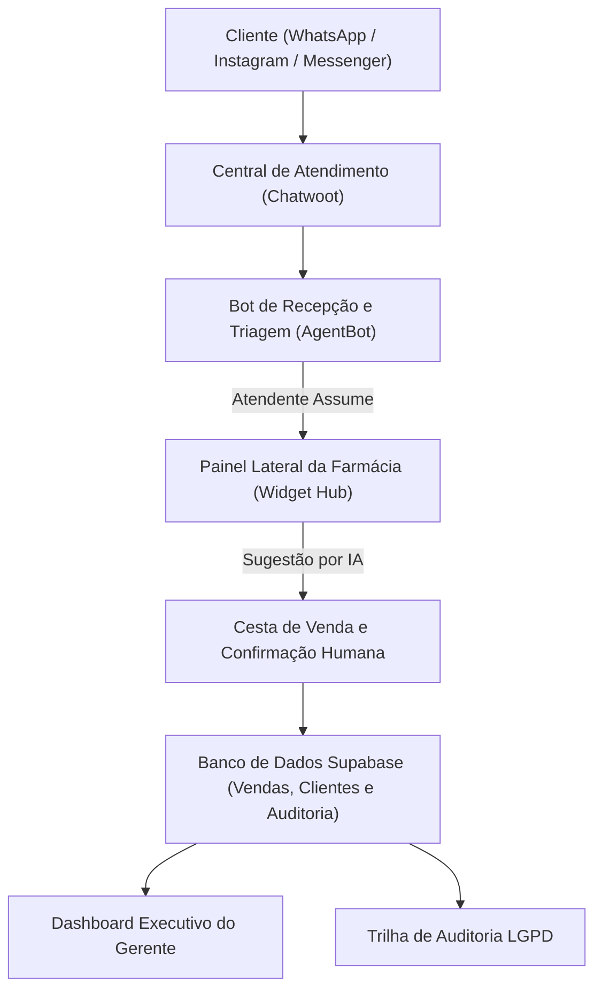

# Manual Operacional e Guia de Capacitação da Equipe
## Hub Omnichannel de Atendimento e Vendas — MultiFarma

Este manual foi elaborado para orientar gestores, farmacêuticos e atendentes da **MultiFarma** na utilização diária da plataforma omnichannel, explicando passo a passo desde o recebimento de mensagens até a conclusão da venda assistida por inteligência artificial e consulta gerencial.

---

## 1. Visão Geral da Plataforma

A plataforma MultiFarma Hub é composta por ferramentas integradas que trabalham em harmonia:

### Links de Acesso aos Ambientes
| Sistema | Endereço de Acesso | Finalidade Principal |
| :--- | :--- | :--- |
| **MultiFarma Hub (Webapp)** | `https://hub.projectvalemind.com` | Dashboard, Auditoria, Chat Interno e Login |
| **Central Chatwoot** | `https://chatwoot.projectvalemind.com` | Painel operacional onde os atendentes conversam com os clientes |
| **WhatsApp Homologação** | `+55 (12) 98283-9041` | Linha oficial de teste conectada via Evolution API |

---

## 2. Contas de Acesso e Papéis (RBAC)

O acesso ao sistema é estritamente controlado por papéis de segurança conforme a Seção 6 do PRD:

### Credenciais de Homologação
Todas as contas de homologação utilizam a senha padrão: **`MultiFarma@2026`**

| Nome do Colaborador | E-mail de Acesso | Papel (Role) | Telas e Permissões de Acesso |
| :--- | :--- | :---: | :--- |
| **Carlos Mendes** | `carlos.gerente@multifarma.com` | `manager` | **Acesso Total:** Dashboard Executivo, Auditoria, Chat Interno e Painel de Vendas |
| **Ana Souza** | `ana.atendente@multifarma.com` | `agent` | **Atendente Farmacêutica:** Painel de Vendas (Chatwoot), Chat Interno *(Bloqueada em /dashboard)* |
| **Bruno Lima** | `bruno.atendente@multifarma.com` | `agent` | **Atendente Filial Jardins:** Painel de Vendas (Chatwoot), Chat da Filial Jardins |
| **Carla Prado** | `carla.atendente@multifarma.com` | `agent` | **Atendente:** Painel de Vendas (Chatwoot) e Chat Interno |
| **Marcos Tech** | `marcos.admin@multifarma.com` | `admin` | **Administrador Técnico:** Configurações e integrações |

> **Regra Essencial de Segurança:** Atendentes com o papel `agent` que tentarem acessar a URL `/dashboard` ou `/audit` serão automaticamente bloqueados pelo sistema e redirecionados para a tela de **Acesso Negado (HTTP 403)**.

---

## 3. Guia Operacional do Atendente (Passo a Passo)

### Passo 1: Recebimento da Mensagem e Triagem Automática
1. O cliente entra em contato pelo **WhatsApp**, **Instagram Direct** ou **Facebook Messenger**.
2. A conversa surge imediatamente na pasta **"Não Atribuídas" (Unassigned)** do Chatwoot.
3. Se a conversa for nova, o **Bot de Triagem** envia a saudação inicial e identifica a intenção do cliente:
   - *Comprar Medicamento:* O bot pergunta qual o produto e se deseja entrega ou retirada.
   - *Enviar Receita Médica:* O bot envia uma confirmação cordial de recebimento (sem diagnósticos clínicos) e transfere imediatamente para um humano.
   - *Falar com Atendente:* O bot desativa e coloca na fila prioritária humana.

### Passo 2: Assumindo a Conversa no Chatwoot
Para evitar que dois atendentes falem com o mesmo cliente ao mesmo tempo:
1. Clique na conversa na lista à esquerda no Chatwoot.
2. Observe o **Painel da Farmácia (Widget)** aberto na coluna direita da tela.
3. Na barra superior destacada em amarelo:
   - Verifique se está escrito **"Fila de Atendimento (Não Atribuído)"**.
   - Selecione a sua unidade (ex: *Unidade Guaratinguetá* ou *Matriz Centro*).
   - Clique no botão verde: **"🙋 Assumir Atendimento"**.
4. O que acontece instantaneamente:
   - A conversa recebe as etiquetas no Chatwoot: `em-atendimento`, `atendido-por:ana-souza`, `unidade:unidade-guaratingueta`.
   - O bot de IA é **desativado atomicamente** (nunca mais responderá por cima de você).
   - A barra fica verde para você: **"🟢 Atendimento em Andamento — Responsável: Ana Souza"**.
   - Para os outros funcionários que abrirem essa conversa, aparecerá o aviso laranja: **"🔒 Cliente em atendimento por Ana Souza"**, garantindo que ninguém atrapalhe sua venda.

### Passo 3: Fechamento da Venda Assistida por IA
1. Enquanto você conversa com o cliente tirando dúvidas, o motor de IA lê a conversa silenciosamente em segundo plano.
2. No painel lateral, clique no botão:
   👉 **"Preencher Formulário com Sugestão"**
3. O painel preenche automaticamente:
   - O medicamento solicitado e a quantidade mencionada (ex: *Dipirona 500mg - 2 caixas*).
   - A forma de atendimento correta (*Entrega em Domicílio* ou *Retirada no Balcão*).
4. **Humano no Controle:** Você pode ajustar qualquer item:
   - Adicionar outros produtos pelo catálogo rápido (+ Paracetamol, + Dorflex, etc.).
   - Conceder desconto (em R$).
   - Digitar o endereço de entrega ou observações da receita.
5. Quando o cliente concordar com os valores, role até o final do painel e clique no botão verde:
   👉 **"Confirmar Venda (Humano)"**
6. Pronto! A venda é gravada no banco de dados do Supabase, o cliente é salvo no CRM da farmácia e o faturamento do dia sobe no Dashboard do Gerente!

---

## 4. Guia Operacional do Gerente / Gestor

### 1. Acompanhamento do Dashboard Executivo (`/dashboard`)
Ao fazer login como **Carlos Mendes (Gerente)**, você é direcionado ao Dashboard:
- **Indicadores Principais (KPIs):**
  - **Faturamento Total:** Soma de todas as vendas reais confirmadas pelos atendentes no Supabase.
  - **Vendas Confirmadas:** Quantidade de pedidos fechados.
  - **Ticket Médio:** Valor médio por pedido.
  - **Taxa de Conversão:** Percentual de conversas que se transformaram em vendas reais.
- **Divisão por Canal:** Faturamento separado por **WhatsApp**, **Instagram** e **Messenger**.
- **Desempenho por Filial:** Comparativo de vendas entre Matriz Centro e Filial Jardins.
- **Ranking de Produtos:** Medicamentos e itens mais vendidos na semana.
- **Botão "Atualizar":** Permite recarregar os números a qualquer segundo em tempo real.

### 2. Trilha de Auditoria Imutável (`/audit`)
Conforme a LGPD e o requisito RF-008 do PRD, cada ação crítica na farmácia gera um registro append-only:
- Toda confirmação de venda (quem vendeu, valor, itens, horário e cliente).
- Toda atribuição de atendimento (quem assumiu a conversa e em qual unidade).
- Logins de funcionários (sucesso ou tentativas incorretas com IP).
- Falhas e handoffs do bot.
- A trilha garante transparência total e impede fraudes ou alterações retroativas não justificadas.

---

## 5. Chat Interno da Equipe (`/chat`)

O MultiFarma Hub possui um canal de mensagens exclusivo para os funcionários se comunicarem rapidamente:
- **Sala Geral:** Avisos institucionais para toda a equipe da rede MultiFarma.
- **Salas por Filial (ex: Jardins):** Comunicação entre os farmacêuticos e balconistas daquela unidade específica (ex: verificar se há estoque de um medicamento na outra loja).
- **Sem Misturar com o Cliente:** Mensagens internas ficam protegidas dentro do Hub e nunca são enviadas ao WhatsApp do cliente.

---

## 6. Canais Omnichannel (WhatsApp, Instagram Direct e Messenger)

O MultiFarma Hub opera em 3 caixas de entrada no Chatwoot:
1. **Caixa 1 — WhatsApp Farmácia:** Conectada via Evolution API ao número de homologação (`+55 12 98283-9041`).
2. **Caixa 2 — Instagram Direct MultiFarma:** Recebe directs enviados para o perfil do Instagram da farmácia.
3. **Caixa 3 — Facebook Messenger MultiFarma:** Recebe mensagens enviadas para a página do Facebook da farmácia.

### Identificação Visual no Widget
Quando o atendente abre uma conversa, o topo do painel indica claramente o canal de origem:
- `📱 WhatsApp`: Badge verde.
- `📸 Instagram`: Badge gradiente rosa/roxo.
- `💬 Messenger`: Badge azul.

---

## 7. Perguntas Frequentes (FAQ) e Dicas Operacionais

### O que fazer se o cliente enviar uma foto de receita médica?
O bot identifica automaticamente o recebimento da imagem, responde agradecendo cordialmente e desativa, deixando a conversa em destaque para você abrir a foto, ler a prescrição e montar a cesta de produtos com segurança.

### O bot pode responder enquanto eu estou digitando?
**Não!** O sistema possui uma trava atômica (*atomic handoff*): assim que você clica em "Assumir Atendimento" ou envia qualquer mensagem manual na conversa, o bot é desligado imediatamente e nunca mais responde nessa conversa.

### Como deslogar ou trocar de atendente no computador da loja?
Basta clicar no ícone de saída (porta com seta) no canto inferior esquerdo da barra lateral do Hub ou no topo do painel. A sessão é encerrada com segurança no Supabase e a tela volta para a página de login.

---

*Manual homologado para o MVP Hub MultiFarma — Vale Mind (Setembro/2026).*
