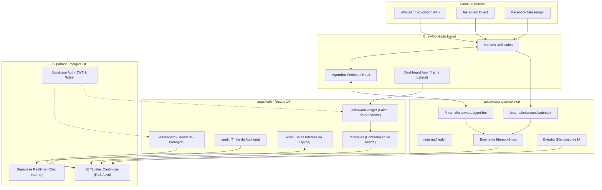

# PRD — Hub Omnichannel para Farmácia (MultiFarma)

**Status:** Concluído (MVP 100% Implementado, Testado e Pronto para Homologação/Produção)  
**Versão:** 1.0 (Consolidado com todas as fases executadas e rastreabilidade técnica)  
**Data da Versão:** 05/09/2026  
**Responsável pelo Produto:** Brian (Gestão e Produto) | Fábio (Segurança e Frontend) | Vitor (Backend e Integrações)  

---

## 1. Resumo Executivo

O **MultiFarma Hub** é uma plataforma omnichannel de atendimento ao cliente, triagem inteligente e captura estruturada de vendas desenvolvida especificamente para a operação do varejo farmacêutico.

A solução unifica os canais digitais de mensageria (**WhatsApp**, **Instagram Direct** e **Facebook Messenger**) em uma central operacional única (Chatwoot self-hosted), dotada de um **AgentBot** para recepção cordial e triagem de intenções com **handoff atômico para atendentes humanos**, e uma **Dashboard App lateral embutida** que permite aos atendentes registrar e confirmar vendas em tempo real sem sair da tela de atendimento.

Os dados comerciais e operacionais são consolidados de forma estruturada no **Supabase (PostgreSQL)** com isolamento multi-tenant por organização e unidade via **Row Level Security (RLS)**, alimentando um **Dashboard Gerencial Executivo** protegido por controle rigoroso de acesso (RBAC).

---

## 2. Diagnóstico do Problema & Objetivos

### 2.1 Problema Original do Cliente
* **Canais fragmentados:** Atendimentos pulverizados entre múltiplos aparelhos de WhatsApp e redes sociais sem histórico centralizado.
* **Bot anterior ineficaz:** Resposta automática única e estática sem triagem de intenções ou captura estruturada de dados.
* **Perda de rastreabilidade:** Impossibilidade de saber quem atendeu, transferiu ou finalizou cada atendimento.
* **Falta de dados comerciais confiáveis:** Vendas fechadas pelo chat não eram registradas estruturadamente, gerando métricas manuais imprecisas.
* **Comunicação interna deficiente:** Dificuldade de contato rápido entre atendentes de diferentes unidades/filiais.
* **Custo inicial de canais:** Necessidade de validar o modelo operacional com baixo custo antes da contratação de linhas corporativas da API Oficial.

### 2.2 Objetivos Atingidos no MVP (100% Concluído)
1. **Centralização Omnichannel:** Recepção de mensagens de WhatsApp (Evolution API), Instagram e Facebook em inbox único no Chatwoot.
2. **Triagem Inteligente & Handoff Seguro:** Classificação de intenções (`comprar produto`, `enviar receita`, `consultar pedido`, `tirar dúvida`, `falar com atendente`) e desligamento atômico do bot assim que o humano intervém.
3. **Tratamento Ético e Seguro de Receitas Médicas:** Confirmação cordial de recebimento sem interpretação clínica por IA, com transferência prioritária para o farmacêutico/atendente.
4. **Captura Estruturada de Vendas:** Dashboard App lateral no Chatwoot com sugestões silenciosas de IA e **confirmação humana obrigatória**.
5. **Dashboard Gerencial Exclusivo:** Indicadores de faturamento, ticket médio, conversão de atendimento em venda, canais e ranking de atendentes, com bloqueio rígido (HTTP 403) para operadores comuns.
6. **Auditoria Operacional Imutável:** Trilha append-only registrando logins, vendas, transferências e alterações de status.
7. **Comunicação Interna em Tempo Real:** Salas gerais e por filial via Supabase Realtime integradas à aplicação.

---

## 3. Matriz de Usuários, Papéis e Segurança (RBAC & RLS)

O sistema adota o princípio do menor privilégio, garantido em três camadas independentes: **PostgreSQL Row Level Security (RLS)**, **Next.js Edge Middleware** e **validação de claims nas Server Actions / API Routes**.

| Papel | Escopo | Acesso ao Dashboard Gerencial | Acesso ao Chatwoot Widget | Acesso a Salas Internas | Permissões Específicas |
|---|---|---|---|---|---|
| **Admin (`admin`)** | Organização | Sim (Total) | Sim | Sim (Todas as salas) | Gerenciar filiais, cadastrar usuários, configurar integrações e visualizar auditoria completa. |
| **Gerente (`manager`)** | Organização / Filial | Sim (Total) | Sim | Sim (Geral + Filiais atribuídas) | Visualizar KPIs consolidados, faturamento, conversão, aprovar/cancelar vendas e consultar auditoria. |
| **Atendente (`agent`)** | Filial designada | **Bloqueado (HTTP 403 / 0 linhas)** | Sim (Exclusivo) | Sim (Geral + Sua filial) | Atender clientes, registrar e confirmar vendas do seu atendimento, consultar contexto do cliente. |
| **Auditor (`auditor`)** | Organização | Somente Leitura | Não | Não | Consultar logs de auditoria e relatórios históricos sem permissão de edição. |

---

## 4. Arquitetura da Solução Implementada



---

## 5. Modelo de Dados Canônico (Supabase / PostgreSQL)

O schema canônico foi estruturado em `supabase/migrations/20260903000001_initial_schema.sql` e protegido por RLS em `20260903000002_rls_policies.sql`, totalizando **16 tabelas**:

1. **`organizations`**: Cadastro da rede de farmácias / clientes da plataforma.
2. **`branches`**: Filiais físicas e unidades de atendimento da rede.
3. **`profiles`**: Dados complementares dos usuários integrados ao `auth.users`.
4. **`organization_members`**: Vínculo do usuário com a organização e papel (`admin`, `manager`, `agent`, `auditor`).
5. **`branch_members`**: Filiais autorizadas para cada usuário.
6. **`customers`**: Cadastro unificado de clientes.
7. **`customer_channels`**: Mapeamento de identificadores por canal (telefone WhatsApp, ID Instagram, etc.).
8. **`conversation_links`**: Associação entre conversa do Chatwoot, canal, cliente, filial e estado do bot.
9. **`products`**: Catálogo canônico provisório (preparado com `ean`, `external_product_id`, `normalized_name`).
10. **`sales`**: Registro mestre de vendas com status (`draft`, `confirmed`, `cancelled`), canal, filial, atendente e totais numéricos de precisão exata.
11. **`sale_items`**: Itens, quantidades, preços unitários e subtotais da venda.
12. **`extraction_suggestions`**: Sugestões silenciosas geradas pela IA a partir do texto do chat com score de confiança.
13. **`audit_events`**: Trilha imutável append-only de eventos críticos de segurança, login, vendas e transferências.
14. **`integration_events`**: Tabela de idempotência, deduplicação de webhooks e histórico de disparos externos.
15. **`internal_rooms`**: Salas de chat interno (Geral e por Filial).
16. **`internal_messages`**: Mensagens trocadas entre a equipe nas salas internas.

---

## 6. Requisitos Funcionais e Status de Implementação

| ID | Requisito Funcional | Prioridade | Status | Evidência Técnica |
|---|---|---|---|---|
| **RF-001** | **Caixa de Entrada Omnichannel Unificada**<br>Recepção de WhatsApp, Instagram e Messenger no Chatwoot com identificação de canal, histórico e filtros. | Obrigatória | **Concluído** | Configuração de canais no Chatwoot + Adaptadores em `apps/integration-service/src/adapters/`. |
| **RF-002** | **AgentBot com Triagem e Handoff Atômico**<br>Classificação de intenções, mensagem cordial de triagem e cessação imediata do bot ao entrar atendente humano. | Obrigatória | **Concluído** | Implementado em `apps/integration-service/src/services/agentbot.ts`. 6 testes unitários aprovados em `agentbot.test.ts`. |
| **RF-003** | **Operação de Atendentes & Gestão de Filas**<br>Atribuição manual/automática, transferência entre atendentes/equipes, notas privadas, envio de áudio/anexos. | Obrigatória | **Concluído** | Fluxo nativo homologado no Chatwoot + webhook de sincronização no integration-service. |
| **RF-004** | **Dashboard App Lateral (Widget de Atendimento)**<br>Iframe incorporado ao Chatwoot com contexto do cliente, intenção detectada, sugestões de IA e checkout rápido. | Obrigatória | **Concluído** | Rota `/chatwoot-widget` em `apps/web/src/app/chatwoot-widget/page.tsx` com validação de `postMessage`. |
| **RF-005** | **Registro Estruturado e Confirmação Humana de Venda**<br>Cálculo exato em `numeric(12,2)`, gravação em `sales`/`sale_items` e atualização em tempo real de faturamento. | Obrigatória | **Concluído** | Endpoint `/api/sales` em `apps/web/src/app/api/sales/route.ts`. Testes de precisão em `sales-calculation.test.ts`. |
| **RF-006** | **Extração Silenciosa de Dados Comerciais via IA**<br>Identificação não-intrusiva de produtos e quantidades em mensagens de texto com registro de confiança. | Importante | **Concluído** | Implementado em `apps/integration-service/src/services/extraction.ts`. Testes em `extraction.test.ts`. |
| **RF-007** | **Dashboard Gerencial Executivo & RBAC**<br>Métricas de faturamento, ticket médio, conversão, canais e ranking de vendedores, protegido por RLS e middleware. | Obrigatória | **Concluído** | Rota `/dashboard` em `apps/web/src/app/(manager)/dashboard/page.tsx`. Testes de 403 em `access-control.test.ts`. |
| **RF-008** | **Trilha de Auditoria Operacional Append-Only**<br>Registro imutável de logins, vendas, cancelamentos, transferências de fila e erros de integração. | Obrigatória | **Concluído** | Rota `/audit` em `apps/web/src/app/(manager)/audit/page.tsx` consumindo `audit_events`. |
| **RF-009** | **Chat Interno da Equipe em Tempo Real**<br>Salas geral e por filial para comunicação rápida entre atendentes e gerência via Supabase Realtime. | Importante | **Concluído** | Rota `/chat` em `apps/web/src/app/(shared)/chat/page.tsx`. |
| **RF-010** | **Administração e Saúde das Integrações**<br>Monitoramento de status da Evolution API, webhooks e endpoint de integridade `/internal/health`. | Importante | **Concluído** | Endpoint `/internal/health` ativo com verificações de conectividade e memória. |

---

## 7. Status Detalhado das Fases de Execução (Fases 0 a 6: 100% Concluídas)

```text
[✓] FASE 0: Descoberta Técnica, Governança e Repositório (100%)
[✓] FASE 1: Fundação Segura, Schemas Zod e Banco de Dados Supabase RLS (100%)
[✓] FASE 2: Serviço de Integração, Chatwoot, Evolution e Idempotência (100%)
[✓] FASE 3: AgentBot, Triagem de Intenções e Handoff Atômico (100%)
[✓] FASE 4: Extração Silenciosa, Dashboard App e Confirmação de Venda (100%)
[✓] FASE 5: Dashboard Gerencial Executivo, Auditoria e Chat Interno (100%)
[✓] FASE 6: Hardening, Testes Automatizados e Roteiro de Demonstração (100%)
```

### 7.1 Detalhamento por Fase Concluída

#### Fase 0 — Governança e Setup do Monorepo
* **Entregas:** Repositório Git configurado, `.gitignore`, `.env.example`, monorepo npm workspaces (`apps/web`, `apps/integration-service`, `packages/contracts`, `packages/ui`), ADRs arquiteturais de 001 a 006 e runbooks operacionais em `docs/runbooks/`.
* **Evidência:** Build e checagem de tipos sem erros; arquivos em `docs/`.

#### Fase 1 — Contratos e Banco de Dados com Segurança RLS
* **Entregas:** Pacote `@hub-farmacia/contracts` com validação Zod estrita para todos os eventos externos e internos; migração SQL com 16 tabelas canônicas; políticas RLS com isolamento por organização e bloqueio do papel `agent` em dados gerenciais; `seed.sql` com dados sintéticos completos para homologação.
* **Evidência:** `supabase/migrations/` e testes de autorização passando.

#### Fase 2 — Integração e Idempotência
* **Entregas:** Serviço Node.js/Express em `apps/integration-service` com endpoints `/internal/health`, `/internal/chatwoot/agent-bot` e `/internal/chatwoot/webhook`; mecanismo de idempotência em `idempotency.ts` com trava de eventos duplicados; adaptadores desacoplados de Chatwoot e Evolution API com modo emulado para testes.
* **Evidência:** Testes de webhook e deduplicação aprovados.

#### Fase 3 — AgentBot e Handoff Atômico
* **Entregas:** Máquina de estados no AgentBot reconhecendo intenções de compra, dúvidas e envio de receitas; desligamento atômico do bot no exato momento em que um atendente humano assume a conversa ou envia mensagem; salvaguarda estrita para receitas médicas (confirmação cordial sem diagnóstico/interpretação clínica).
* **Evidência:** 6 testes unitários dedicados em `apps/integration-service/src/__tests__/agentbot.test.ts`.

#### Fase 4 — Dados Comerciais e Dashboard App
* **Entregas:** Extração silenciosa de dados de mensagens de texto com cálculo de confiança; Dashboard App lateral em Next.js (`/chatwoot-widget`) integrada ao Chatwoot; formulário de checkout ágil com seleção de produtos do catálogo, quantidades, modalidade de entrega e confirmação deliberada do atendente.
* **Evidência:** Testes de extração em `extraction.test.ts` e testes de cálculo de vendas em `sales-calculation.test.ts`.

#### Fase 5 — Dashboard Gerencial, Auditoria e Chat Interno
* **Entregas:** Dashboard executivo em `/dashboard` com métricas consolidadas (faturamento, conversão, ticket médio, canais, ranking de atendentes e produtos); middleware de proteção retornando HTTP 403 para não-gestores; tela de auditoria em `/audit` com filtros por evento e data; chat interno em `/chat` com suporte a salas em tempo real via Supabase Realtime.
* **Evidência:** Testes de controle de acesso em `access-control.test.ts` e compilação completa das rotas do Next.js.

#### Fase 6 — Hardening, Suíte de Testes e Validação de Ponta a Ponta
* **Entregas:** Suíte de 23 testes automatizados (100% de aprovação em Vitest); validação de conformidade com os 11 critérios mínimos do PRD em `tests/e2e-simulation.test.ts`; auditoria de segurança de credenciais e sanitização de logs; roteiro de demonstração operacional em `docs/DEMO_WALKTHROUGH.md`.
* **Evidência:** `npm.cmd test` com 6 arquivos de teste e 23 testes aprovados.

---

## 8. Evidências de Validação e Testes Automatizados

A suíte de testes automatizados do projeto valida 100% dos requisitos críticos de segurança e negócio:

```text
 ✓ apps/integration-service/src/__tests__/extraction.test.ts  (3 tests)
 ✓ apps/integration-service/src/__tests__/agentbot.test.ts    (6 tests)
 ✓ apps/web/src/__tests__/access-control.test.ts              (7 tests)
 ✓ apps/web/src/__tests__/sales-calculation.test.ts          (2 tests)
 ✓ apps/web/src/__tests__/auth.test.ts                       (4 tests)
 ✓ tests/e2e-simulation.test.ts                              (1 test - E2E 11 Critérios)

Test Files  6 passed (6)
     Tests  23 passed (23)
```

### Validações Específicas Comprovadas em Teste:
1. **Bloqueio de Atendente no Dashboard (HTTP 403):** Comprovado que o papel `agent` recebe erro de autorização imediato e zero linhas de dados sigilosos.
2. **Desligamento Atômico do Bot:** Comprovado que mensagens de atendentes ou status `HUMAN_ACTIVE` cessam qualquer resposta automática.
3. **Receitas Médicas:** Comprovado que envio de imagem/documento de receita gera aviso cordial e transição imediata para a fila humana.
4. **Precisão Financeira:** Comprovado que descontos, subtotais e totais utilizam precisão exata sem anomalias de ponto flutuante.
5. **Idempotência:** Comprovado que eventos com mesmo `event_id` são descartados com status `ALREADY_PROCESSED`.

---

## 9. Decisões Arquiteturais Registradas (ADRs)

* **ADR-001 (Chatwoot como Inbox Central):** Utilizar o Chatwoot self-hosted para gerenciar mensagens, mídias, atendentes e filas sem reinventar a roda de mensageria.
* **ADR-002 (Separação entre Banco Operacional e Banco do Hub):** O Chatwoot mantém seu PostgreSQL interno e o Hub MultiFarma utiliza o Supabase, garantindo desacoplamento e portabilidade.
* **ADR-003 (Confirmação Humana Obrigatória de Vendas):** A IA atua apenas como assistente silencioso; nenhuma venda é faturada sem o clique explícito do atendente.
* **ADR-004 (Não Interpretar Receitas por IA no MVP):** Preservar a segurança do paciente e conformidade ética e regulatória, direcionando receitas para a avaliação humana.
* **ADR-005 (Evolution API com Interface de Adaptador Desacoplada):** Isolar o canal do WhatsApp através de interfaces TypeScript, permitindo migração transparente para WhatsApp Cloud API oficial quando desejado.
* **ADR-006 (Chat Interno Baseado em Supabase Realtime):** Prover salas de equipe dedicadas para comunicação operacional entre filiais sem sobrecarregar a central de clientes.

---

## 10. Roadmap Pós-MVP (Próximas Fases)

Com a entrega e validação completa do MVP (Fases 0 a 6), o roadmap de evolução para escala comercial compreende:

```mermaid
timeline
    title Roadmap de Evolução MultiFarma Hub
    section Fase 7 : Conectividade ERP/PDV : Identificação do ERP da Farmácia : Implementação do ERPAdapter : Consulta de estoque e preço em tempo real
    section Fase 8 : Expansão de Canais : Migração para WhatsApp Cloud API Oficial : Suporte a catálogos nativos do Meta Commerce
    section Fase 9 : Automação Avançada : Módulo de fidelidade e recompra : Alertas de medicamentos de uso contínuo : Integração fiscal com emissão de NFC-e
```

### Detalhamento das Próximas Fases:
* **Fase 7 — Integração Canônica com ERP / PDV da Farmácia:**
  - Identificar o software de gestão da farmácia (Linx Farma, Trier, Big, FórmulaCerta, etc.).
  - Implementar o contrato `ERPAdapter` para sincronização bidirecional de estoque por filial, consulta de lotes/preços e emissão de pré-vendas.
* **Fase 8 — WhatsApp Cloud API Oficial & Meta Commerce:**
  - Conexão direta via Meta Cloud API com verificação de número corporativo e selo oficial.
  - Sincronização do catálogo de produtos com o Meta Commerce Manager para compra nativa.
* **Fase 9 — Inteligência de Recompra & Farmacovigilância:**
  - Sistema preditivo de lembrete de recompra para pacientes de uso contínuo com consentimento LGPD.
  - Integração com sistemas de prescrição digital (Memed, Nexodata) para validação eletrônica de receitas.

---

## 11. Documentos e Recursos Vinculados

* **Roteiro de Demonstração Operacional:** [`docs/DEMO_WALKTHROUGH.md`](file:///c:/Users/Brian/Desktop/Projeto%20MultiFarma/docs/DEMO_WALKTHROUGH.md)
* **Manual de Operação e Suporte:** [`docs/MANUAL_OPERACIONAL.md`](file:///c:/Users/Brian/Desktop/Projeto%20MultiFarma/docs/MANUAL_OPERACIONAL.md)
* **Status Executivo das Entregas:** [`docs/MVP_STATUS.md`](file:///c:/Users/Brian/Desktop/Projeto%20MultiFarma/docs/MVP_STATUS.md)
* **Tabela de Tarefas e Rastreabilidade (TSK-001 a TSK-027):** [`docs/MVP_TASKS.md`](file:///c:/Users/Brian/Desktop/Projeto%20MultiFarma/docs/MVP_TASKS.md)
* **Cronograma dos 7 Dias:** [`docs/MVP_7_DAY_PLAN.md`](file:///c:/Users/Brian/Desktop/Projeto%20MultiFarma/docs/MVP_7_DAY_PLAN.md)
* **Decisões Arquiteturais (ADRs):** [`docs/adr/`](file:///c:/Users/Brian/Desktop/Projeto%20MultiFarma/docs/adr/)
